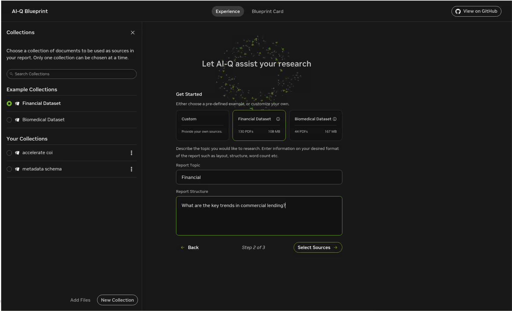
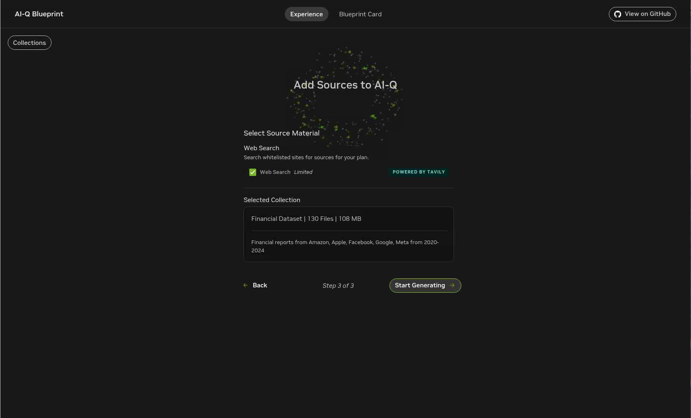

# Lab 2: Deploy and Test the AI-Q Research Assistant

## Introduction

In this lab, you will deploy the NVIDIA AI-Q Research Assistant on the same OKE environment used by the RAG Blueprint. AI-Q reuses the Nemotron Super 49B service from Lab 1 and adds research workflows, document collection selection, Tavily web search, report generation, report editing, and Phoenix tracing.

Estimated Time: 60 minutes

### Objectives

In this lab, you will:

- Configure the Tavily API key used for web search.
- Deploy AI-Q with Helm.
- Load default financial and biomedical document collections.
- Open the AI-Q interface.
- Generate and refine a research report.
- Use troubleshooting checks for common deployment issues.

## Task 1: Configure Tavily

1. Set your Tavily API key. Replace `<YOUR_TAVILY_API_KEY>` with your Tavily API key.

    ```
    <copy>export TAVILY_API_KEY="<YOUR_TAVILY_API_KEY>"</copy>
    ```

2. Confirm that the variable is set.

    ```
    <copy>echo "Tavily: $TAVILY_API_KEY"</copy>
    ```

3. Confirm that your `NGC_API_KEY` value from Lab 1 is still available in the same shell session.

    ```
    <copy>echo "NGC key is set: ${NGC_API_KEY:+yes}"</copy>
    ```

## Task 2: Prepare the AI-Q Helm Chart

1. Change to the AI-Q Helm chart directory.

    ```
    <copy>cd ~/aiq-aira/</copy>
    ```

2. Build the chart dependencies.

    ```
    <copy>helm dependency build</copy>
    ```

## Task 3: Deploy AI-Q

1. Deploy the AI-Q Helm chart.

    This command deploys a Helm release named `aira` into the current Kubernetes namespace. It disables a second LLM deployment and points AI-Q to the Nemotron and RAG services that you deployed in Lab 1.

    ```
    <copy>helm install aira ~/aiq-aira/ \
      --set imagePullSecret.create=false \
      --set imagePullSecret.name=ngc-secret \
      --set ngcApiSecret.create=false \
      --set ngcApiSecret.name=ngc-api \
      --set nginx.nginxImage.name=docker.io/nginx \
      --set phoenix.image.repository=docker.io/arizephoenix/phoenix \
      --set config.tavily_api_key=$TAVILY_API_KEY \
      --set config.instruct_model_name="nvidia/llama-3.3-nemotron-super-49b-v1" \
      --set config.instruct_base_url="http://nim-llm:8000/v1" \
      --set config.nemotron_model_name="nvidia/llama-3.3-nemotron-super-49b-v1" \
      --set config.nemotron_base_url="http://nim-llm:8000/v1" \
      --set config.rag_url="http://rag-server:8081" \
      --set config.rag_ingest_url="http://ingestor-server:8082" \
      --set config.milvus_host="milvus" \
      --set config.milvus_port="19530" \
      --set nim-llm.enabled=false \
      --set frontend.enabled=true</copy>
    ```

    Expected output:

    ```
    NAME: aira
    LAST DEPLOYED: Wed Oct 8 19:30:00 2025
    STATUS: deployed
    REVISION: 1
    ```

## Task 4: Monitor the AI-Q Deployment

1. Watch pod startup.

    ```
    <copy>kubectl get pods --watch</copy>
    ```

    Expected output during startup:

    ```
    NAME                         READY   STATUS              RESTARTS   AGE
    aira-aira-backend-xxxxx      0/1     ContainerCreating   0          15s
    aira-frontend-xxxxx          0/1     ContainerCreating   0          15s
    aira-nginx-xxxxx             0/1     ContainerCreating   0          15s
    aira-phoenix-xxxxx           0/1     ContainerCreating   0          15s
    ```

2. Press `Ctrl+C` to stop watching.

3. Wait 2 to 3 minutes, then confirm that the AI-Q pods are running.

    ```
    <copy>kubectl get pods</copy>
    ```

    Expected output:

    ```
    NAME                                      READY   STATUS    RESTARTS   AGE
    aira-aira-backend-7b8c9d5f4-xk2pm         1/1     Running   0          3m
    aira-frontend-6d7f8c9b5-jp4tn             1/1     Running   0          3m
    aira-nginx-5c8d7b6f9-mn3rl                1/1     Running   0          3m
    aira-phoenix-847b9c5d6-kp2wq              1/1     Running   0          3m
    ```

4. Confirm that no additional Nemotron LLM pod was deployed for AI-Q.

    ```
    <copy>kubectl get pods | grep nim-llm</copy>
    ```

    AI-Q should reuse the `rag-nim-llm-0` pod from Lab 1.

## Task 5: Load Default Collections

1. Make sure you are still in the AI-Q Helm chart directory.

    ```
    <copy>cd ~/aiq-aira/</copy>
    ```

2. Apply the load-files job.

    ```
    <copy>kubectl apply -f load-files.yaml</copy>
    ```

3. Monitor the loading progress.

    ```
    <copy>kubectl logs -l job-name=load-files-nv-ingest -f</copy>
    ```

4. Wait for completion messages. The default financial and biomedical collections usually take 5 to 10 minutes to load.

## Task 6: Open AI-Q

1. Print the AI-Q frontend URL.

    ```
    <copy>printenv | grep -i AIRA_DOMAIN</copy>
    ```

2. Open the URL in a browser.

    You can also find the URL in the Luna Desktop app under the **Resources** tab.

3. Verify that the AI-Q Research Assistant interface loads.

    

## Task 7: Generate a Research Report

1. In AI-Q, select **Financial Dataset** from the collection selector.

    

2. Enable **Web Search** to include Tavily results.

    

3. Enter the following research topic:

    ```
    What are the key trends in commercial lending?
    ```

4. Click **Generate Report**.

5. Wait 2 to 3 minutes while AI-Q generates search queries, searches the selected collection, searches the web, synthesizes findings, and creates the report.

6. Review the final report for document-backed and web-backed content.

## Task 8: Edit and Refine the Report

1. Click **Edit** on any report section.

2. Modify the content, add your own findings, or request an AI rewrite.

3. Click **Regenerate Section** to refine a specific section.

4. Click **Save** when the section is ready.

## Task 9: Try Additional Research Topics

1. Test the OCI document collection from Lab 1.

    - Topic: `Compare Oracle Cloud Infrastructure AI capabilities with industry trends`
    - Collection: `OCI Documentation`
    - Web Search: Enabled
    - Expected result: AI-Q combines the uploaded Oracle PDF with web research to summarize OCI AI positioning.

2. Test the biomedical collection.

    - Topic: `Recent advances in cancer immunotherapy`
    - Collection: `Biomedical Dataset`
    - Web Search: Enabled

3. Test another financial analysis topic.

    - Topic: `Impact of interest rate changes on commercial real estate`
    - Collection: `Financial Dataset`
    - Web Search: Enabled

## Task 10: Troubleshoot Common Issues

1. If AI-Q cannot connect to Nemotron, verify that the RAG LLM pod and service are available.

    ```
    <copy>kubectl get pods | grep nim-llm
    kubectl get svc nim-llm</copy>
    ```

2. If the frontend cannot reach the backend, check the nginx and backend pods.

    ```
    <copy>kubectl get pods | grep -E "nginx|backend"
    kubectl logs <nginx-pod-name></copy>
    ```

3. If Tavily web search is not working, verify that the Tavily API key reached the backend configuration.

    ```
    <copy>kubectl get secret aira-aira-backend-config -o yaml | grep tavily_api_key</copy>
    ```

4. If the default collections do not appear, check the load-files job.

    ```
    <copy>kubectl get jobs
    kubectl logs job/load-files-nv-ingest</copy>
    ```

5. If AI-Q pods show `ImagePullBackOff`, verify the NGC image pull secret.

    ```
    <copy>kubectl get secret ngc-secret -o yaml
    echo "$NGC_API_KEY"</copy>
    ```

6. If report generation is slow during the first run, wait for model warmup to complete. First-time TensorRT engine startup can take several minutes, and subsequent runs are usually faster.

## Learn More

- [NVIDIA AI-Q Blueprint documentation](https://build.nvidia.com/nvidia/ai-research-assistant)
- [AI-Q GitHub repository](https://github.com/NVIDIA-AI-Blueprints/aiq-research-assistant)
- [Oracle Kubernetes Engine documentation](https://docs.oracle.com/en-us/iaas/Content/ContEng/home.htm)
- [NVIDIA NIM documentation](https://docs.nvidia.com/nim/)
- [Tavily API documentation](https://docs.tavily.com)

## Acknowledgements

* **Author** - Oracle LiveLabs
* **Last Updated By/Date** - Oracle LiveLabs, May 2026
