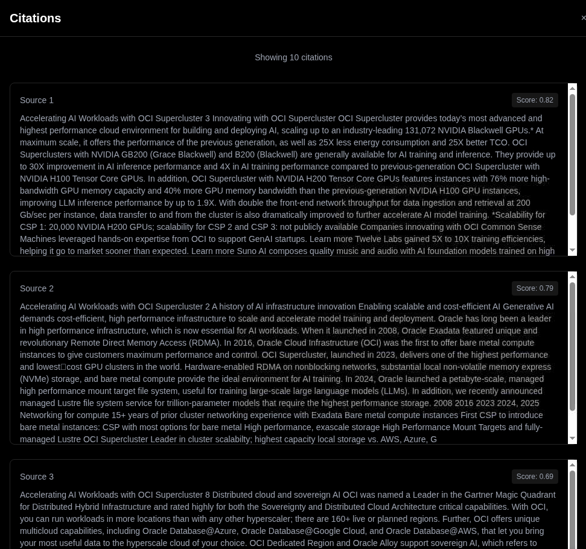

# Lab 2: Deploy and Test RAG

## Introduction

Deploy the two-GPU RAG profile and validate document ingestion and question answering through the platform-owned HTTP route.

### Objectives

- Install RAG and wait for the local model services.
- Upload the OCI PDF and inspect the answer's document sources.

Estimated Time: 45 minutes, including model startup.

## Prerequisites

Complete Lab 1 in this variant. Keep its Cloud Shell session and exported variables available.

## Task 1: Deploy RAG Blueprint 2.6.0

1. Confirm that Cloud Shell uses Helm 3. RAG 2.6.0 failed validation with Helm
   4 because the rendered deployment contained a duplicate environment variable.

    ```bash
    helm version --short
    ```

    Continue only when the reported client major version is `v3`.

2. Deploy RAG into the assigned namespace. The command deliberately keeps the
   frontend internal (`ClusterIP`) because its public URL is platform-managed.

    ```bash
    helm upgrade --install rag \
      https://helm.ngc.nvidia.com/nvidia/blueprint/charts/nvidia-blueprint-rag-v2.6.0.tgz \
      --namespace "$LAB_NAMESPACE" \
      --username '$oauthtoken' \
      --password "$NGC_API_KEY" \
      --reset-values \
      --set-string imagePullSecret.password="$NGC_API_KEY",ngcApiSecret.password="$NGC_API_KEY" \
      --set frontend.service.type=ClusterIP \
      --set-string seaweedfs.image.repository=docker.io/chrislusf/seaweedfs \
      --set server.workers=4,nv-ingest.redis.replica.replicaCount=0 \
      --set nv-ingest.resources.limits.cpu=24,nv-ingest.resources.limits.memory=24Gi \
      --set nimOperator.nim-llm.enabled=true \
      --set nimOperator.nim-llm.image.repository=nvcr.io/nim/nvidia/nemotron-3.5-lightning-30b-a3b \
      --set-string 'nimOperator.nim-llm.image.tag=2.0.9-variant,nimOperator.nim-llm.model.engine=vllm,nimOperator.nim-llm.model.precision=int4,nimOperator.nim-llm.model.tensorParallelism=1,nimOperator.nim-llm.model.profiles[0]=2ef85c7286907e706eb0d6c4750a1aefa719447097d151ab34c7837fc02bdac4,nimOperator.nim-llm.storage.pvc.size=200Gi,nimOperator.nvidia-nim-llama-nemotron-embed-1b-v2.storage.pvc.size=200Gi' \
      --set 'nimOperator.nim-llm.resources.requests.nvidia\.com/gpu=1,nimOperator.nim-llm.resources.limits.nvidia\.com/gpu=1' \
      --set-json 'nimOperator.nim-llm.env=[{"name":"NIM_HTTP_API_PORT","value":"8000"},{"name":"NIM_TRITON_LOG_VERBOSE","value":"1"},{"name":"NIM_SERVED_MODEL_NAME","value":"nvidia/nemotron-3.5-lightning"},{"name":"NIM_MODEL_PROFILE","value":"2ef85c7286907e706eb0d6c4750a1aefa719447097d151ab34c7837fc02bdac4"}]' \
      --set-string envVars.APP_LLM_MODELNAME=nvidia/nemotron-3.5-lightning,envVars.APP_QUERYREWRITER_MODELNAME=nvidia/nemotron-3.5-lightning,envVars.APP_FILTEREXPRESSIONGENERATOR_MODELNAME=nvidia/nemotron-3.5-lightning,envVars.REFLECTION_LLM=nvidia/nemotron-3.5-lightning,envVars.LLM_ENABLE_THINKING=false,envVars.LLM_MAX_TOKENS=2048 \
      --set nimOperator.nvidia-nim-llama-nemotron-embed-1b-v2.enabled=true,nimOperator.nvidia-nim-llama-nemotron-embed-vl-1b-v2.enabled=false,nimOperator.nvidia-nim-llama-nemotron-rerank-1b-v2.enabled=false \
      --set nimOperator.nvidia-nim-llama-nemotron-rerank-vl-1b-v2.enabled=false \
      --set 'nimOperator.nvidia-nim-llama-nemotron-embed-1b-v2.resources.requests.nvidia\.com/gpu=1,nimOperator.nvidia-nim-llama-nemotron-embed-1b-v2.resources.limits.nvidia\.com/gpu=1' \
      --set-string envVars.APP_EMBEDDINGS_SERVERURL=nemotron-embedding-ms:8000/v1,envVars.APP_EMBEDDINGS_MODELNAME=nvidia/llama-nemotron-embed-1b-v2,ingestor-server.envVars.APP_EMBEDDINGS_SERVERURL=nemotron-embedding-ms:8000/v1,ingestor-server.envVars.APP_EMBEDDINGS_MODELNAME=nvidia/llama-nemotron-embed-1b-v2,nv-ingest.envVars.EMBEDDING_NIM_ENDPOINT=http://nemotron-embedding-ms:8000/v1,nv-ingest.envVars.EMBEDDING_NIM_MODEL_NAME=nvidia/llama-nemotron-embed-1b-v2 \
      --set-string envVars.ENABLE_RERANKER=True,envVars.APP_RANKING_MODELNAME=nvidia/llama-nemotron-rerank-vl-1b-v2,envVars.APP_RANKING_SERVERURL=https://ai.api.nvidia.com,envVars.ENABLE_VLM_RERANKER_IMAGE_INPUT=False \
      --set nv-ingest.nimOperator.ocr.enabled=false,nv-ingest.nimOperator.graphic_elements.enabled=false,nv-ingest.nimOperator.page_elements.enabled=false,nv-ingest.nimOperator.table_structure.enabled=false \
      --set-string ingestor-server.envVars.APP_NVINGEST_PDFEXTRACTMETHOD=pdfium,ingestor-server.envVars.APP_NVINGEST_EXTRACTTABLES=False,ingestor-server.envVars.APP_NVINGEST_EXTRACTCHARTS=False,nv-ingest.envVars.COMPONENTS_TO_READY_CHECK= \
      --wait=false
    ```

    Reranking uses NVIDIA's hosted VL reranker with text-only input. Its local
    NIM stays disabled, so the workshop still uses only two GPUs. The former
    hosted text reranker returned HTTP 410 during validation; changing only
    its endpoint did not resolve the error.

3. Apply the fully qualified SeaweedFS image used during validation and use
   a quota-safe RAG update strategy, then
   wait for the RAG services and model downloads. The first model startup
   took about 16 minutes in the September test; cold downloads can take
   longer. Temporary volume-mount retries can resolve while the model cache
   is being attached.

   The RAG server updates one pod at a time without a surge pod. This avoids
   exceeding the namespace memory quota during upgrades; RAG is briefly
   unavailable while its single backend pod is replaced. Documents remain
   stored in Elasticsearch and the persistent object store.

    ```bash
    kubectl patch deployment rag-seaweedfs-all-in-one --type=json \
      -p='[{"op":"replace","path":"/spec/template/spec/containers/0/image","value":"docker.io/chrislusf/seaweedfs:3.73"}]'

    kubectl patch deployment rag-server --type=merge \
      -p='{"spec":{"strategy":{"type":"RollingUpdate","rollingUpdate":{"maxSurge":0,"maxUnavailable":1}}}}'
    kubectl rollout status deployment/rag-server --timeout=20m

    kubectl wait --for=jsonpath='{.status.state}'=Ready nimservice --all --timeout=90m
    kubectl wait --for=jsonpath='{.status.health}'=green elasticsearch --all --timeout=30m
    kubectl rollout status deployment/rag-frontend --timeout=20m
    ```

## Task 2: Open and validate RAG

1. Confirm the two NIM services are ready and open the RAG URL supplied by the
   workshop environment:

    ```bash
    kubectl get nimservice
    kubectl get elasticsearch
    kubectl get service rag-frontend
    printf '%s\n' "$RAG_APP_URL"
    ```

2. Open `$RAG_APP_URL` in a browser. Create a collection named `OCI
   Documentation`, upload the [OCI Supercluster PDF](https://www.oracle.com/a/ocom/docs/cloud/accelerate-ai-with-oci-supercluster.pdf), and ask:

    ```text
    What is OCI Supercluster and what makes it unique?
    ```

    

    

## Conclusion

The RAG application is reachable and can answer a question using the uploaded document.

Continue to [Lab 3: Deploy and Test AI-Q](../deploy-aiq-research-assistant/deploy-aiq-research-assistant-sandbox-lite.md).

## Acknowledgements

- **Authors:** Oracle and NVIDIA workshop team
- **Last Updated:** October 2026
