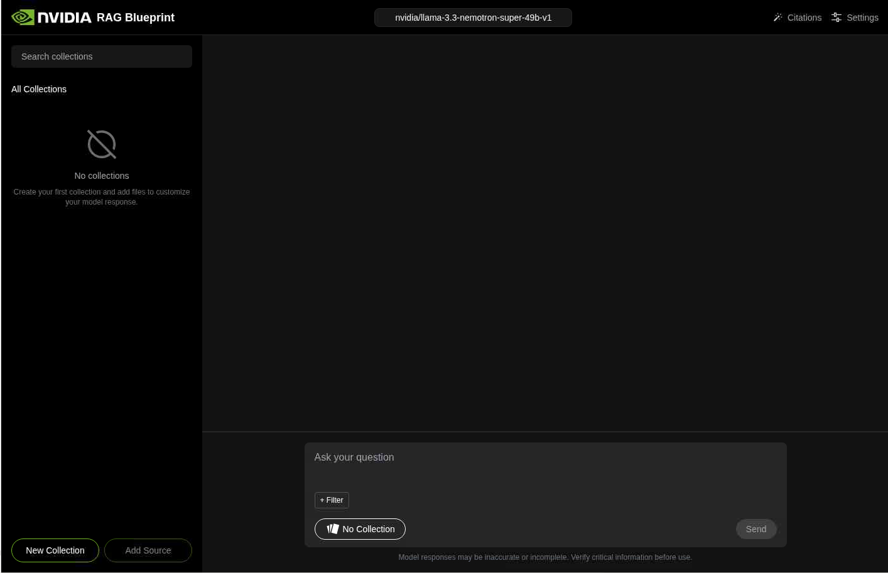
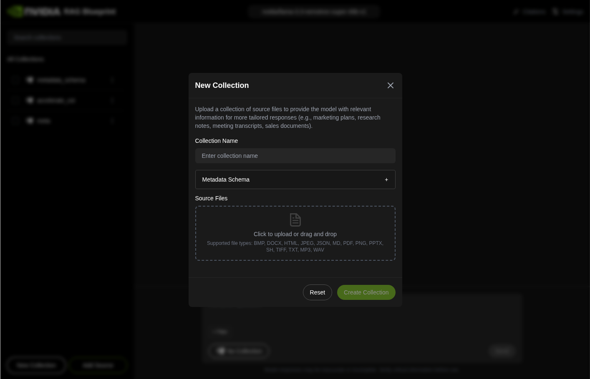
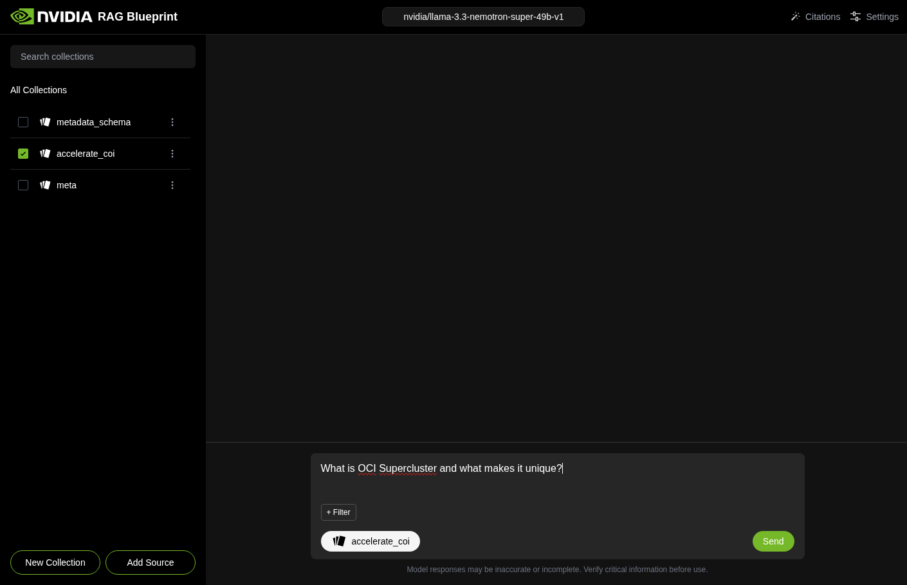
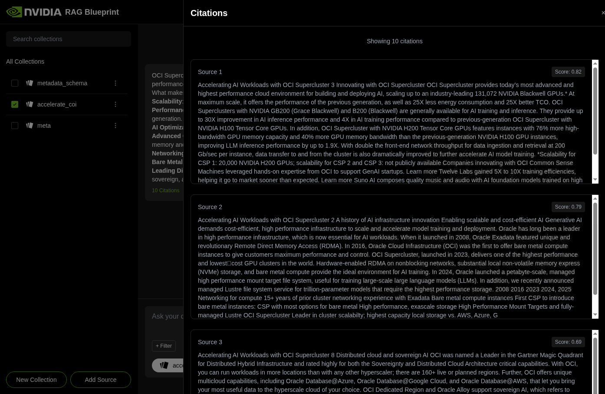

# Lab 1: Deploy the NVIDIA RAG Blueprint

## Introduction

In this lab, you will deploy the NVIDIA RAG Blueprint on Oracle Kubernetes Engine. The deployment includes the Nemotron Super 49B LLM, embedding and reranking services, PDF text extraction, Milvus vector storage, and a browser-based RAG playground.

Estimated Time: 60 minutes

### Objectives

In this lab, you will:

- Verify access to the OKE cluster.
- Configure the NVIDIA Helm repository with your NGC API key.
- Deploy the RAG Blueprint by using Helm.
- Monitor pod startup until the RAG services are ready.
- Upload an Oracle Cloud Infrastructure document and validate cited RAG answers.

## Task 1: Verify OKE Access

1. Open **Cloud Shell**.

2. Verify that `kubectl` can reach your OKE cluster.

    ```
    <copy>kubectl get nodes</copy>
    ```

    Expected output:

    ```
    NAME          STATUS   ROLES   AGE   VERSION   INTERNAL-IP   EXTERNAL-IP   OS-IMAGE
    10.0.10.116   Ready    node    18h   v1.30.1   10.0.10.116   <none>        Oracle Linux Server 8.10
    ```

3. Confirm that the GPU node is in the `Ready` state before continuing.

## Task 2: Configure NVIDIA Helm Access

1. Set your NVIDIA API key as an environment variable. Replace `<YOUR_NGC_API_KEY>` with your NVIDIA API key.

    ```
    <copy>export NGC_API_KEY="<YOUR_NGC_API_KEY>"</copy>
    ```

2. Add the NVIDIA Helm repository.

    ```
    <copy>helm repo add nvidia https://helm.ngc.nvidia.com/nim \
      --username '$oauthtoken' \
      --password "$NGC_API_KEY"</copy>
    ```

3. Update the repository metadata.

    ```
    <copy>helm repo update nvidia</copy>
    ```

    Expected output:

    ```
    Hang tight while we grab the latest from your chart repositories...
    ...Successfully got an update from the "nvidia" chart repository
    Update Complete.
    ```

## Task 3: Deploy the RAG Blueprint

1. Deploy the RAG Blueprint Helm chart.

    This command deploys a Helm release named `rag` into your current Kubernetes namespace. It also configures the NVIDIA NIM services, ingestion service, vector store, and frontend used by the RAG playground.

    ```
    <copy>helm install rag https://helm.ngc.nvidia.com/nvidia/blueprint/charts/nvidia-blueprint-rag-v2.2.0.tgz \
      --username '$oauthtoken' \
      --password "${NGC_API_KEY}" \
      --set imagePullSecret.password=$NGC_API_KEY \
      --set ngcApiSecret.password=$NGC_API_KEY \
      --set nim-llm.enabled=true \
      --set nim-llm.image.repository="nvcr.io/nim/nvidia/llama-3.3-nemotron-super-49b-v1" \
      --set nim-llm.image.tag="1.8.5" \
      --set nim-llm.resources.limits."nvidia\.com/gpu"="4" \
      --set nim-llm.resources.requests."nvidia\.com/gpu"="4" \
      --set nvidia-nim-llama-32-nv-embedqa-1b-v2.enabled=true \
      --set nvidia-nim-llama-32-nv-embedqa-1b-v2.image.tag="1.9.0" \
      --set nvidia-nim-llama-32-nv-embedqa-1b-v2.resources.limits."nvidia\.com/gpu"=1 \
      --set nvidia-nim-llama-32-nv-embedqa-1b-v2.resources.requests."nvidia\.com/gpu"=1 \
      --set text-reranking-nim.enabled=true \
      --set text-reranking-nim.image.tag="1.7.0" \
      --set text-reranking-nim.resources.limits."nvidia\.com/gpu"=1 \
      --set text-reranking-nim.resources.requests."nvidia\.com/gpu"=1 \
      --set ingestor-server.enabled=true \
      --set ingestor-server.envVars.APP_VECTORSTORE_ENABLEGPUINDEX="False" \
      --set ingestor-server.envVars.APP_VECTORSTORE_ENABLEGPUSEARCH="False" \
      --set ingestor-server.envVars.APP_NVINGEST_EXTRACTTEXT="True" \
      --set ingestor-server.envVars.APP_NVINGEST_EXTRACTTABLES="False" \
      --set ingestor-server.envVars.APP_NVINGEST_EXTRACTCHARTS="False" \
      --set ingestor-server.envVars.APP_NVINGEST_EXTRACTIMAGES="False" \
      --set ingestor-server.envVars.APP_NVINGEST_EXTRACTINFOGRAPHICS="False" \
      --set ingestor-server.envVars.APP_NVINGEST_ENABLEPDFSPLITTER="True" \
      --set ingestor-server.envVars.APP_NVINGEST_CHUNKSIZE="1024" \
      --set ingestor-server.envVars.APP_NVINGEST_CHUNKOVERLAP="150" \
      --set ingestor-server.envVars.NV_INGEST_FILES_PER_BATCH="32" \
      --set ingestor-server.envVars.NV_INGEST_CONCURRENT_BATCHES="8" \
      --set ingestor-server.envVars.ENABLE_MINIO_BULK_UPLOAD="True" \
      --set ingestor-server.envVars.NV_INGEST_DEFAULT_TIMEOUT_MS="5000" \
      --set ingestor-server.nv-ingest.envVars.INGEST_DISABLE_DYNAMIC_SCALING="True" \
      --set ingestor-server.nv-ingest.envVars.MAX_INGEST_PROCESS_WORKERS="32" \
      --set ingestor-server.nv-ingest.envVars.NV_INGEST_MAX_UTIL="80" \
      --set ingestor-server.nv-ingest.envVars.INGEST_EDGE_BUFFER_SIZE="128" \
      --set ingestor-server.nv-ingest.milvus.image.all.repository="docker.io/milvusdb/milvus" \
      --set ingestor-server.nv-ingest.milvus.image.all.tag="v2.5.3" \
      --set ingestor-server.nv-ingest.milvus.image.tools.repository="docker.io/milvusdb/milvus-config-tool" \
      --set ingestor-server.nv-ingest.milvus.minio.image.repository="docker.io/minio/minio" \
      --set ingestor-server.nv-ingest.milvus.standalone.resources.limits."nvidia\.com/gpu"=0 \
      --set ingestor-server.nv-ingest.nemoretriever-page-elements-v2.deployed=true \
      --set ingestor-server.nv-ingest.nemoretriever-page-elements-v2.image.tag="1.4.0" \
      --set ingestor-server.nv-ingest.nemoretriever-page-elements-v2.resources.limits."nvidia\.com/gpu"=1 \
      --set ingestor-server.nv-ingest.nemoretriever-page-elements-v2.resources.requests."nvidia\.com/gpu"=1 \
      --set ingestor-server.nv-ingest.nemoretriever-graphic-elements-v1.deployed=false \
      --set ingestor-server.nv-ingest.nemoretriever-table-structure-v1.deployed=false \
      --set ingestor-server.nv-ingest.paddleocr-nim.deployed=false \
      --set ingestor-server.nv-ingest.redis.image.repository="redis" \
      --set ingestor-server.nv-ingest.redis.image.tag="8.2.1" \
      --set envVars.ENABLE_RERANKER="True" \
      --set frontend.enabled=true</copy>
    ```

    Expected output:

    ```
    NAME: rag
    LAST DEPLOYED: Wed Oct 8 18:56:23 2025
    STATUS: deployed
    REVISION: 1
    ```

## Task 4: Monitor the RAG Deployment

1. Watch the pods start.

    ```
    <copy>kubectl get pods</copy>
    ```

    Expected output after several minutes:

    ```
    NAME                                                        READY   STATUS    RESTARTS   AGE
    ingestor-server-79484c759c-2f7w9                            1/1     Running   0          10m
    milvus-standalone-594df6565-42rsj                           1/1     Running   0          10m
    rag-etcd-0                                                  1/1     Running   0          10m
    rag-frontend-547bc85495-lz9lc                               1/1     Running   0          10m
    rag-minio-f88fb7fd4-7n88n                                   1/1     Running   0          10m
    rag-nemoretriever-page-elements-v2-699b99c566-m5zql         1/1     Running   0          10m
    rag-nim-llm-0                                               0/1     Running   0          10m
    rag-nv-ingest-85b544688c-kgq47                              1/1     Running   0          10m
    rag-nvidia-nim-llama-32-nv-embedqa-1b-v2-86797758f4-dnf8s   1/1     Running   0          10m
    rag-redis-master-0                                          1/1     Running   0          10m
    rag-redis-replicas-0                                        1/1     Running   0          10m
    rag-server-b9d44657b-7c8gb                                  1/1     Running   0          10m
    rag-text-reranking-nim-5868b47978-dvvzf                     1/1     Running   0          10m
    ```

2. Wait for `rag-nim-llm-0` to show `READY 1/1`.

    Nemotron Super 49B can take 10 to 15 minutes to build TensorRT engines during first startup. Continue only after all pods are ready.

## Task 5: Open the RAG Playground

1. Print the RAG frontend URL.

    ```
    <copy>echo "http://$RAG_DOMAIN"</copy>
    ```

2. Open the URL in a browser.

3. Verify that the RAG Playground loads.

    

## Task 6: Upload and Query an OCI Document

1. Download the Oracle OCI Supercluster PDF from [Accelerating AI with OCI Supercluster](https://www.oracle.com/a/ocom/docs/cloud/accelerate-ai-with-oci-supercluster.pdf).

2. In the RAG Playground, click **New Collection**.

    

3. Enter `OCI Documentation` as the collection name, then create the collection.

4. Upload the downloaded `accelerate-ai-with-oci-supercluster.pdf` file.

    

5. Wait for document processing to complete. Small PDFs usually complete in 30 to 60 seconds.

6. Ask the following question:

    ```
    What is OCI Supercluster and what makes it unique?
    ```

7. Review the answer for information about Oracle AI infrastructure, RDMA, bare metal instances, and scale-out GPU clusters.

8. Try the following additional questions:

    - `How many NVIDIA GPUs can OCI Supercluster scale to?`
    - `What are the main AI use cases supported on OCI?`
    - `How does Oracle partner with NVIDIA for AI workloads?`

## Task 7: Verify Citations

1. Open the **Citations** panel in the RAG Playground.

2. Confirm that the response includes source references, cited snippets, and confidence scores.

    

3. Use the cited source text to validate that the generated answer is grounded in the uploaded PDF.

## Acknowledgements

* **Author** - Oracle LiveLabs
* **Last Updated By/Date** - Oracle LiveLabs, May 2026
