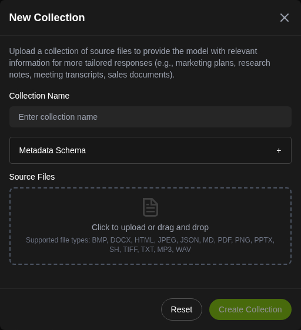

# Deploy NVIDIA RAG and AI-Q on OKE: 2-GPU Workshop

## Introduction

In this workshop, you deploy NVIDIA RAG Blueprint 2.6.0 and NVIDIA AI-Q 2.1.0
in the namespace assigned to your LiveLabs reservation. The shared OKE cluster,
GPU nodes, NVIDIA operators, ECK operator, Istio ingress, and public HTTP
routes are prepared by the workshop platform.

You deploy only namespaced application resources from Cloud Shell. Do not
create a VCN, load balancer, namespace, Istio `Gateway`, Istio
`VirtualService`, or DNS record.

### Objectives

- Connect Cloud Shell to your assigned OKE namespace.
- Deploy the two-GPU RAG profile and validate its services.
- Deploy AI-Q in FRAG mode and connect it to RAG.
- Open the pre-provisioned RAG and AI-Q `nip.io` HTTP URLs.
- Generate a research report using private and web sources.

Estimated Time: 90 minutes, including initial NIM model download and startup.

## Architecture and workshop constraints

- The reservation provides one namespace: `$LAB_NAMESPACE`.
- The workshop platform creates the public routes before you begin. The URLs
  resolve before the applications are ready; they can return a temporary 503
  response until their frontend Service has endpoints.
- RAG and AI-Q frontend Services must be `ClusterIP`. The platform-owned
  Istio routes expose them as HTTP URLs.
- This profile uses two local A100 GPUs: one for Nemotron 3.5 Lightning
  generation and one for embeddings. Reranking and AI-Q research model calls
  use the NVIDIA API. GPU quota caps usage; the platform must also provide
  two available GPUs when admitting the reservation.
- PDF ingestion uses CPU text extraction. Use a text-based PDF for this lab;
  OCR, table, chart, and page-layout models are disabled in this profile.
- Your account is intentionally namespace-scoped. Commands that list nodes,
  storage classes, or cluster operators may be forbidden; those checks are
  performed by the lab platform.

## Prerequisites

The LiveLabs environment must provide the following values in the **Resources**
tab or startup output:

- `LAB_NAMESPACE`
- `OKE_CLUSTER_ID`
- `RAG_APP_URL`
- `AIQ_APP_URL`

You also need an NGC API key with access to the required NVIDIA charts and
models, an NVIDIA API key, and a Tavily API key. Accept the required model
terms in NGC before deployment. Task 2 generates a password for the
PostgreSQL database deployed alongside AI-Q; no existing database is needed.

Do not paste API keys or passwords into source control, screenshots, or chat.

## Task 1: Connect Cloud Shell to the assigned namespace

1. Copy the **Cloud Shell setup commands** from the LiveLabs Resources tab.
   They contain the assigned namespace, cluster OCID, region, kubeconfig
   download command, and both HTTP application URLs. If only individual
   values are displayed, set them below using the supplied values.

    ```bash
    export LAB_NAMESPACE="<your-assigned-namespace>"
    export OKE_CLUSTER_ID="<shared-oke-cluster-ocid>"
    export OCI_REGION="<assigned-oke-region>"
    export RAG_APP_URL="<RAG-application-URL-from-Resources>"
    export AIQ_APP_URL="<AI-Q-application-URL-from-Resources>"
    ```

2. If you used the setup commands, the kubeconfig is already downloaded.
   Otherwise, run the following commands. Access is scoped by your IAM and
   Kubernetes permissions; the kubeconfig selects the shared cluster.
   `--with-auth-context` preserves the OCI authentication settings used when
   downloading it.

    ```bash
    mkdir -p "$HOME/.kube"
    export KUBECONFIG="$HOME/.kube/${LAB_NAMESPACE}.yaml"
    oci ce cluster create-kubeconfig \
      --cluster-id "$OKE_CLUSTER_ID" \
      --file "$KUBECONFIG" \
      --region "$OCI_REGION" \
      --token-version 2.0.0 \
      --kube-endpoint PUBLIC_ENDPOINT \
      --with-auth-context

    kubectl config set-context --current --namespace="$LAB_NAMESPACE"
    kubectl get pods
    ```

3. Verify the chart-required namespaced APIs. All authorization checks must
   return `yes`.

    ```bash
    kubectl auth can-i create nimservices.apps.nvidia.com
    kubectl auth can-i create nimcaches.apps.nvidia.com
    kubectl auth can-i create elasticsearches.elasticsearch.k8s.elastic.co
    kubectl auth can-i create networkpolicies.networking.k8s.io
    kubectl get resourcequota
    ```

## Task 2: Configure credentials securely

1. Use hidden prompts so secret values are not echoed.

    ```bash
    read -rsp "NGC API key: " NGC_API_KEY; printf '\n'
    read -rsp "NVIDIA API key (press Enter to reuse NGC key): " NVIDIA_API_KEY; printf '\n'
    NVIDIA_API_KEY="${NVIDIA_API_KEY:-$NGC_API_KEY}"
    read -rsp "Tavily API key: " TAVILY_API_KEY; printf '\n'
    AIQ_DB_PASSWORD="$(openssl rand -base64 32)"
    export NGC_API_KEY NVIDIA_API_KEY TAVILY_API_KEY AIQ_DB_PASSWORD
    ```

2. Create only the AI-Q application Secret. RAG Helm creates and owns
   `ngc-secret` and `ngc-api` in Task 3 from the supplied chart values.
   Pre-creating those names causes a Helm release-ownership error.
   The generated database password stays in your shell and the Secret.

    ```bash
    kubectl create secret generic aiq-credentials \
      --from-literal=DB_USER_NAME=aiq \
      --from-literal=DB_USER_PASSWORD="$AIQ_DB_PASSWORD" \
      --from-literal=NVIDIA_API_KEY="$NVIDIA_API_KEY" \
      --from-literal=TAVILY_API_KEY="$TAVILY_API_KEY" \
      --dry-run=client -o yaml | kubectl apply -f -
    ```

## Task 3: Deploy RAG Blueprint 2.6.0

1. Confirm that Cloud Shell uses Helm 3. RAG 2.6.0 failed validation with Helm
   4 because the rendered deployment contained a duplicate environment variable.

    ```bash
    helm version --short
    ```

    Continue only when the reported client major version is `v3`.

2. Deploy RAG into the assigned namespace. The command deliberately keeps the
   frontend internal (`ClusterIP`) because its public URL is platform-managed.

    ```bash
    helm upgrade --install rag \
      https://helm.ngc.nvidia.com/nvidia/blueprint/charts/nvidia-blueprint-rag-v2.6.0.tgz \
      --namespace "$LAB_NAMESPACE" \
      --username '$oauthtoken' \
      --password "$NGC_API_KEY" \
      --reset-values \
      --set-string imagePullSecret.password="$NGC_API_KEY",ngcApiSecret.password="$NGC_API_KEY" \
      --set frontend.service.type=ClusterIP \
      --set server.workers=4,nv-ingest.redis.replica.replicaCount=0 \
      --set nv-ingest.resources.limits.cpu=24,nv-ingest.resources.limits.memory=24Gi \
      --set nimOperator.nim-llm.enabled=true \
      --set nimOperator.nim-llm.image.repository=nvcr.io/nim/nvidia/nemotron-3.5-lightning-30b-a3b \
      --set-string 'nimOperator.nim-llm.image.tag=2.0.9-variant,nimOperator.nim-llm.model.engine=vllm,nimOperator.nim-llm.model.precision=int4,nimOperator.nim-llm.model.tensorParallelism=1,nimOperator.nim-llm.model.profiles[0]=2ef85c7286907e706eb0d6c4750a1aefa719447097d151ab34c7837fc02bdac4,nimOperator.nim-llm.storage.pvc.size=200Gi,nimOperator.nvidia-nim-llama-nemotron-embed-1b-v2.storage.pvc.size=200Gi' \
      --set 'nimOperator.nim-llm.resources.requests.nvidia\.com/gpu=1,nimOperator.nim-llm.resources.limits.nvidia\.com/gpu=1' \
      --set-json 'nimOperator.nim-llm.env=[{"name":"NIM_HTTP_API_PORT","value":"8000"},{"name":"NIM_TRITON_LOG_VERBOSE","value":"1"},{"name":"NIM_SERVED_MODEL_NAME","value":"nvidia/nemotron-3.5-lightning"},{"name":"NIM_MODEL_PROFILE","value":"2ef85c7286907e706eb0d6c4750a1aefa719447097d151ab34c7837fc02bdac4"}]' \
      --set-string envVars.APP_LLM_MODELNAME=nvidia/nemotron-3.5-lightning,envVars.APP_QUERYREWRITER_MODELNAME=nvidia/nemotron-3.5-lightning,envVars.APP_FILTEREXPRESSIONGENERATOR_MODELNAME=nvidia/nemotron-3.5-lightning,envVars.REFLECTION_LLM=nvidia/nemotron-3.5-lightning,envVars.LLM_ENABLE_THINKING=false,envVars.LLM_MAX_TOKENS=2048 \
      --set nimOperator.nvidia-nim-llama-nemotron-embed-1b-v2.enabled=true,nimOperator.nvidia-nim-llama-nemotron-embed-vl-1b-v2.enabled=false,nimOperator.nvidia-nim-llama-nemotron-rerank-1b-v2.enabled=false \
      --set 'nimOperator.nvidia-nim-llama-nemotron-embed-1b-v2.resources.requests.nvidia\.com/gpu=1,nimOperator.nvidia-nim-llama-nemotron-embed-1b-v2.resources.limits.nvidia\.com/gpu=1' \
      --set-string envVars.APP_EMBEDDINGS_SERVERURL=nemotron-embedding-ms:8000/v1,envVars.APP_EMBEDDINGS_MODELNAME=nvidia/llama-nemotron-embed-1b-v2,ingestor-server.envVars.APP_EMBEDDINGS_SERVERURL=nemotron-embedding-ms:8000/v1,ingestor-server.envVars.APP_EMBEDDINGS_MODELNAME=nvidia/llama-nemotron-embed-1b-v2,nv-ingest.envVars.EMBEDDING_NIM_ENDPOINT=http://nemotron-embedding-ms:8000/v1,nv-ingest.envVars.EMBEDDING_NIM_MODEL_NAME=nvidia/llama-nemotron-embed-1b-v2 \
      --set-string envVars.ENABLE_RERANKER=True \
      --set-string 'envVars.APP_RANKING_SERVERURL=' \
      --set nv-ingest.nimOperator.ocr.enabled=false,nv-ingest.nimOperator.graphic_elements.enabled=false,nv-ingest.nimOperator.page_elements.enabled=false,nv-ingest.nimOperator.table_structure.enabled=false \
      --set-string ingestor-server.envVars.APP_NVINGEST_PDFEXTRACTMETHOD=pdfium,ingestor-server.envVars.APP_NVINGEST_EXTRACTTABLES=False,ingestor-server.envVars.APP_NVINGEST_EXTRACTCHARTS=False,nv-ingest.envVars.COMPONENTS_TO_READY_CHECK= \
      --wait=false
    ```

3. Apply the fully qualified SeaweedFS image used during validation, then
   wait for the RAG services and model downloads. The first model startup
   took about 16 minutes in the September test; cold downloads can take
   longer. Temporary volume-mount retries can resolve while the model cache
   is being attached.

    ```bash
    kubectl patch deployment rag-seaweedfs-all-in-one --type=json \
      -p='[{"op":"replace","path":"/spec/template/spec/containers/0/image","value":"docker.io/chrislusf/seaweedfs:3.73"}]'

    kubectl wait --for=jsonpath='{.status.state}'=Ready nimservice --all --timeout=90m
    kubectl wait --for=jsonpath='{.status.health}'=green elasticsearch --all --timeout=30m
    kubectl rollout status deployment/rag-frontend --timeout=20m
    ```

## Task 4: Open and validate RAG

1. Confirm the two NIM services are ready and open the RAG URL supplied by the
   workshop environment:

    ```bash
    kubectl get nimservice
    kubectl get elasticsearch
    kubectl get service rag-frontend
    printf '%s\n' "$RAG_APP_URL"
    ```

2. Open `$RAG_APP_URL` in a browser. Create a collection named `OCI
   Documentation`, upload the [OCI Supercluster PDF](https://www.oracle.com/a/ocom/docs/cloud/accelerate-ai-with-oci-supercluster.pdf), and ask:

    ```text
    What is OCI Supercluster and what makes it unique?
    ```

    

    

## Task 5: Deploy AI-Q 2.1.0 in FRAG mode

1. Install AI-Q into the same assigned namespace. `aiq.appname` must equal the
   assigned namespace; the chart otherwise attempts to create a different
   namespace, which a workshop user is not permitted to use.

    ```bash
    helm upgrade --install aiq210-frag \
      https://helm.ngc.nvidia.com/nvidia/blueprint/charts/aiq2-web-2.1.0.tgz \
      --namespace "$LAB_NAMESPACE" \
      --username '$oauthtoken' \
      --password "$NGC_API_KEY" \
      --reset-values \
      --set aiq.appname="$LAB_NAMESPACE" \
      --set aiq.project.deploymentTarget=kind \
      --set 'aiq.apps.backend.imagePullSecrets[0].name=ngc-secret' \
      --set 'aiq.apps.frontend.imagePullSecrets[0].name=ngc-secret' \
      --set-string aiq.apps.backend.env.CONFIG_FILE=configs/config_web_frag.yml \
      --set-string aiq.apps.backend.env.RAG_SERVER_URL=http://rag-server:8081/v1 \
      --set-string aiq.apps.backend.env.RAG_INGEST_URL=http://ingestor-server:8082/v1 \
      --set-string aiq.apps.backend.env.COLLECTION_NAME=aiq_frag_workshop \
      --set aiq.apps.postgres.image.repository=docker.io/bitnami/postgresql \
      --set aiq.apps.frontend.service.type=ClusterIP \
      --set aiq.apps.backend.ingress.enabled=false \
      --set aiq.apps.frontend.ingress.enabled=false \
      --set aiq.apps.postgres.ingress.enabled=false \
      --wait=false
    ```

2. Correct the PostgreSQL initializer image and wait for the frontend and
   backend to become ready:

    ```bash
    kubectl patch deployment aiq-backend --type=json \
      -p='[{"op":"replace","path":"/spec/template/spec/initContainers/0/image","value":"docker.io/bitnami/postgresql:latest"}]'

    kubectl rollout status deployment/aiq-postgres --timeout=20m
    kubectl rollout status deployment/aiq-backend --timeout=20m
    kubectl rollout status deployment/aiq-frontend --timeout=20m
    ```

## Task 6: Open and test AI-Q

1. Validate the application from Cloud Shell without exposing a new public
   endpoint:

    ```bash
    kubectl port-forward service/aiq-backend 8000:8000
    ```

    In another terminal:

    ```bash
    curl -sf http://127.0.0.1:8000/health
    curl -sf http://127.0.0.1:8000/v1/knowledge/health
    ```

    Stop the port-forward with `Ctrl+C` after the checks succeed.

2. Open `$AIQ_APP_URL` and confirm the Research Assistant loads. Enable **Web
   Search**, ask a research question, and confirm the completed report includes
   web sources and RAG knowledge where applicable.

## Task 7: Troubleshoot and clean up

- A missing `Elasticsearch` or `NIMService` API is a platform issue. Do not try
  to install cluster-wide operators from the attendee account.
- If a NIM model is not ready, inspect its status, pods, and namespace events:

    ```bash
    kubectl get nimservice
    kubectl describe nimservice
    kubectl get pods -o wide
    kubectl get events --sort-by=.metadata.creationTimestamp | tail -50
    ```

- If either portal URL resolves but returns a temporary error, verify the
  matching frontend deployment and Service endpoints. Do not create a new
  load balancer or alter Istio routing.
- If kubeconfig download returns `NotAuthorizedOrNotFound` immediately
  after provisioning, wait a minute and retry. If it persists, ask the
  facilitator to check the reservation IAM policy and assigned cluster.
- Namespaced NetworkPolicy permissions are required for the chart's Redis
  policy. They do not allow changes to OCI VCNs, subnets, or load balancers.
- To remove application resources before your reservation ends:

    ```bash
    helm uninstall aiq210-frag
    helm uninstall rag
    ```

  PersistentVolumeClaims can retain data. Delete them only if the lab
  administrator confirms that the data is no longer needed.

## Screenshot follow-up

The collection dialog and citations images are cropped from the existing RAG
workshop. The previous AI-Q images show an older interface and are omitted.
During the next full end-to-end test, capture screenshots for:

1. the LiveLabs Resources panel showing the assigned `RAG_APP_URL` and
   `AIQ_APP_URL` (with reservation-specific identifiers redacted);
2. the fully rendered RAG and AI-Q pages reached through `nip.io` HTTP;
3. the RAG document-upload and completed-answer states for this two-GPU
   profile;
4. AI-Q web-search and completed-report states for the 2.1.0 FRAG chart.

## Acknowledgements

- **Authors:** Oracle and NVIDIA workshop team
- **Last Updated:** October 2026
